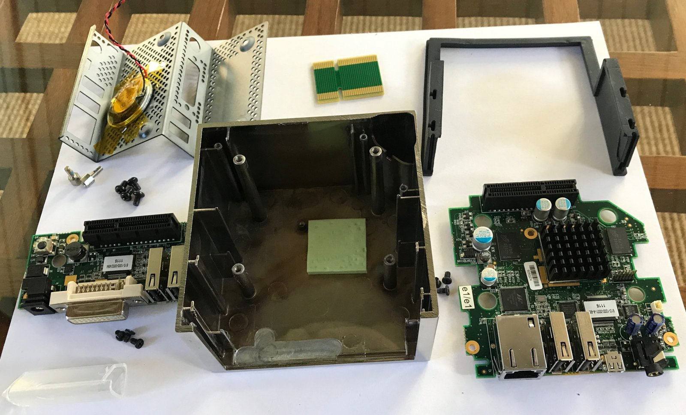
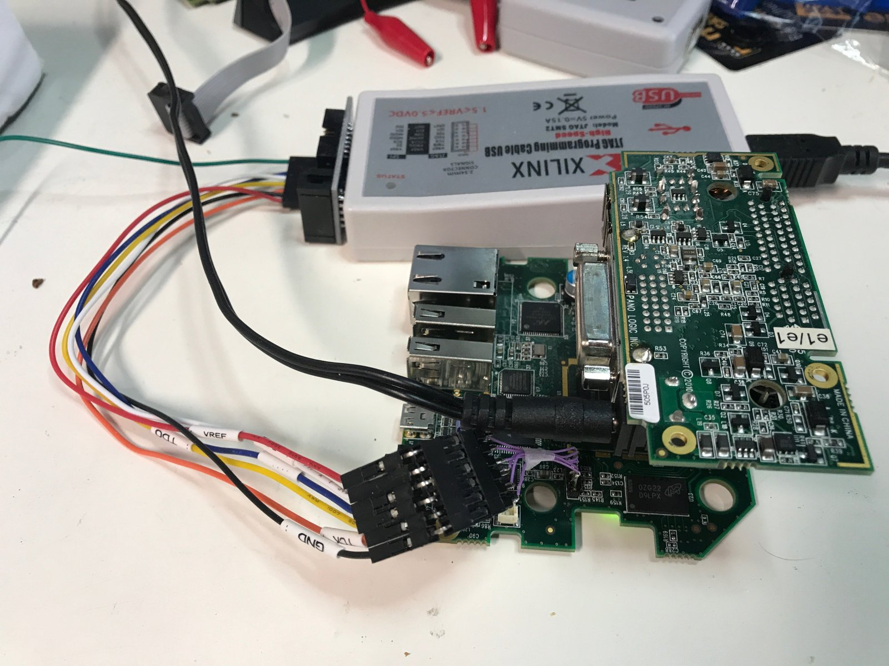
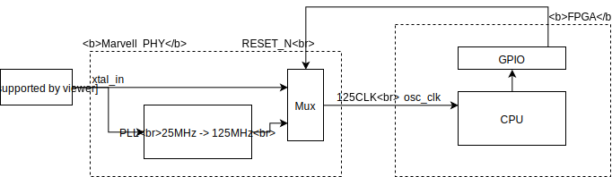
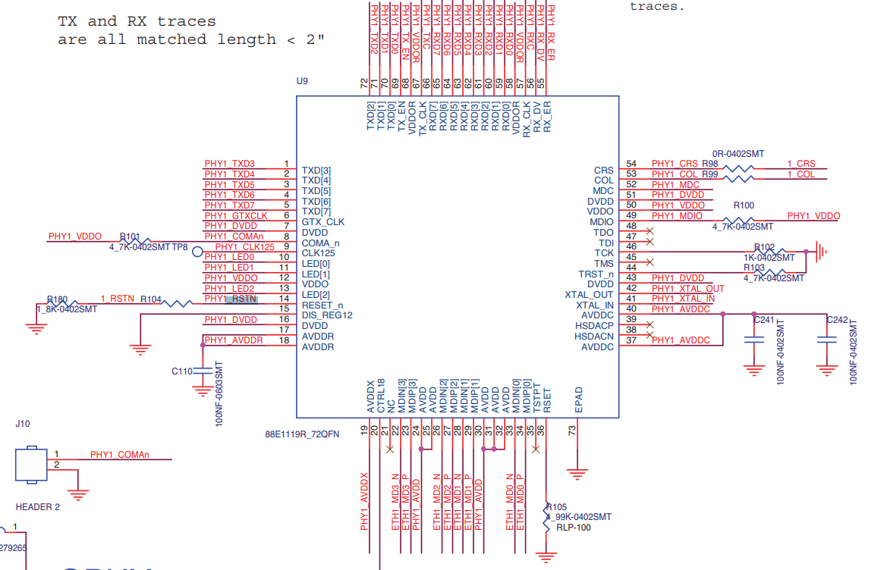

# Pano Logic Zero Client G2 

## Introduction

This project contains the reverse engineering results of the Pano Logic Zero Client G2.

It was started by [cyrozap](https://github.com/cyrozap/Pano-Logic-Zero-Client-G2-FPGA-Demo), who
did all the hard work of figuring out connections between the FPGA and peripheral ICs. Some of this work
can also be found on [his wiki page](https://pano-wiki.cyrozap.com/wiki:g2_zero_client), though 
this GitHub repo should now all have that information as well.

There is a similar effort that focuses, among other things, on expanding the Pano Logic G2 with a break-out board.
Check [here](https://github.com/twj42/PanoLogicG2_ReverseEngineering) for further information.

The Pano Logic G2 is the successor of the [Pano Logic G1](https://github.com/tomverbeure/panologic). Like the
G1, it has all the interfaces that are needed to build a small mini-computer with an FPGA.

**IMPORTANT: There are 2 versions of the Pano Logic G2: some use a Spartan 6 LX150 while others use an LX100, which is smaller but still very large, and with equal amount of block RAM and DSPs.** 
You should be able to distinguish between the two by the revision code: LX150 is rev B and LX100 is rev C. But beware: there are VGA-based Pano G1s that are also called rev C. So always check first that your unit has the right video connector.

Compared to the G1, the most important improvements of G2 are:

* Much larger FPGA: a [Xilinx Spartan-6 XC6SLX150 or XC6SLX100](https://www.xilinx.com/support/documentation/data_sheets/ds160.pdf)

    This is one of the largest Spartan-6 devices, and a huge upgrade compared to the Spartan-3 1600 FPGA of the G1!
    
    For the longest time, this device was not supported by the free Xilinx ISE 14.7, and it's still not supported
    by that Linux version. However, there is now an ISE 14.7 for Win10 version that not only supports Spartan-6,
    but it supports the larger devices such as the LX150/LX100 as well!

* 128MByte of DDR2 SDRAM instead of 32MByte of LPDDR SDRAM.

* 128Mbit serial flash instead of 8Mbit.

* DVI instead of VGA output

    The Chrontel chip that drives the DVI part also supports VGA, and these VGA pins are connected to the
    analog DVI pins. So VGA is still supported with a simple, passive DVI-to-VGA adapter.

* Micro-HDMI output

* Gigabit Ethernet 

## Disassembly

Overly detailed disassembly pictures can be found [here](https://tomverbeure.github.io/pano/logic/2018/12/02/Pano-Logic-G2-Disassembly.html).

## JTAG

Instructions on how to get the JTAG going are [here](https://tomverbeure.github.io/pano/logic/2018/12/03/Pano-logic-JTAG-First-Contact.html).

## FPGA Connections

See the [Pano.ucf](Pano.ucf) file for all the FPGA connections.

These were all reverse engineered by cyrozap.

## FPGA External Clocking Architecture

According to the initial reverse engineered pin assignment by cyrozap, there is a fixed 25MHz oscillator input
into the FPGA on pin `Y13` that will serve all your clocking needs.

The reality is a bit more interesting. The real clocking architecture (with my custom FPGA content) is as follows:

There is indeed a 25MHz clock oscillator on the PCB, but instead of going straight to the FPGA, it goes to the Marvell Ethernet PHY instead.

The PHY has a fixed ratio 25MHz to 125MHz PLL. That 125MHz clock is used internally, but also brought out to the `125CLK` pin which is
in turn connected to pin `Y13` of the FPGA.

However, when the PHY is in reset, this PLL is disabled and pin `125CLK` carries the original 25MHz instead! (This
is not documented in the datasheet of the close cousin of this PHY.)

When you don't use the PHY, it's natural to not assign any value to the FPGA pin that drives the PHY `RESET_` pin, so without knowning this
quirk of the design, one gets tricked into assuming that pin `Y13` *always* carries a clock of 25MHz.

But as soon as you want to use the PHY and deassert its reset, the clock switches to 125MHz!

For designs with Ethernet support, there are 2 options:

1. Always have the FPGA deassert (drive to 1) the reset pin of the PHY.

    In this case, pin `Y13` will always carry 125MHz and you can design your logic with that clock in mind.
    It has the disadvantage that you'll never be able to toggle the reset pin of the PHY at will.

2. Make you design capable of dealing with both 25MHz and 125MHz.

    This is a bit more complicated, but it will allow you to toggle the reset pin.

It's usually not necessary to reset a PHY which makes the first option the most attractive one.

(Since I wasn't aware of this clocking arrangement at first, my initial choice was of course the second one...)

## Board to Board Connector

The Board to Board connector was reverse engineered by twj42.
The table below is based on 
[this page](https://github.com/twj42/PanoLogicG2_ReverseEngineering/blob/master/pages/bob.md).

| Pin Nr             |   | FPGA Pin          | Function     |  | Function   | FPGA Pin | 
|--------------------|---|-------------------|--------------|--|------------|----------| 
|                    |   |                   | Outside      |  | Inside     |          | 
|                    |   |                   |              |  |            |          | 
| 1                  |   |                   | GND          |  | GND        |          | 
| 2                  |   |                   | 3.3V         |  | 3.3V       |          | 
| 3                  | ` | D17               | DVI_D[0]     |  | DVI_D[1]   | A14      | 
| 4                  |   | A15               | DVI_D[2]     |  | DVI_D[3]   | A16      | 
| 5                  |   | A17               | DVI_D[4]     |  | DVI_D[5]   | A18      | 
| 6                  |   |                   | GND          |  | GND        |          | 
| 7                  |   | D14               | DVI_D[6]     |  | DVI_D[7]   | B14      | 
| 8                  |   | B16               | DVI_D[8]     |  | DVI_D[9]   | B18      | 
| 9                  |   | E16               | DVI_D[10]    |  | DVI_D[11]  | D15      | 
| 10                 |   |                   | GND          |  | GND        |          | 
| 11                 |   | H12               | PANO_BUTTON  |  | DVI_XCLK_P | E14      | 
|                    |   |                   |              |  |            |          | 
| 12                 |   | F13               | LED_GREEN    |  | DVI_XCLK_N | F15      | 
| 13                 |   | H13               | LED_BLUE     |  | 5V         |          | 
| 14                 |   |                   | 5V           |  | ?          |          | 
| 15                 |   |                   | GND          |  | DVI_SPD    | D9       | 
| 16                 |   |                   | 5V           |  | 5V         |          | 
| 17                 |   |                   | ?            |  | 1.8V       |          | 
| 18                 |   |                   | GND          |  | GND        |          | 
| 19                 |   |                   | 1.8V         |  | 1.8V       |          | 
| 20                 |   | C14               | DVI_DDC_SCL  |  | DVI_H      | F12      | 
| 21                 |   | C17               | DVI_DDC_SDA  |  | DVI_V      | C16      | 
| 22                 |   |                   | GND          |  | GND        |          | 
| 23                 |   |                   | ?            |  | DVI_DE     | F14      | 
| 24                 |   |                   | ?            |  | DVI_RESET_ | C15?     | 
| 25                 |   |                   | ?            |  | DVI_HPINT  | D13      | 
| 26                 |   |                   | GND          |  | GND        |          | 
| 27                 |   |                   | Linked to 28 |  | USB J2     |          | 
| 28                 |   |                   | Linked to 27 |  | USB J2     |          | 
| 29                 |   |                   | 1.2V         |  | 1.2V       |          | 
| 30                 |   |                   | GND          |  | USB J3     |          | 
| 31                 |   |                   | 1.2V         |  | USB J3     |          | 
| 32                 |   |                   | GND          |  | GND        |          | 

## Resources

* Xilinx Spartan-6 XC6SLX150 FGG484 speed grade 2 / Spartan-6 XC6SLX100

  Features:

  * 147K / 101K logic cells 
  * 23K / 16K  slices (4 6-input LUTs per slice, 8 FFs per slice)
  * 184K / 127K FFs
  * 1355 / 976 Kbit max distributed RAM
  * 4824 / 4824 Kbit max block RAM (268 RAMs)
  * 180 / 180 DSPs (1 18x18 multiplier + pre-addr + accumulator)
  * 6 CMTs (2 DCMs and 1 PLL per CMT)
  * 4 memory controllers (2 used for the DDR2 SDRAM)

  Documents: 

  * [Spartan-6 Family Overview](https://www.xilinx.com/support/documentation/data_sheets/ds160.pdf)
  * [LX150-FGG484 Pin List](https://www.xilinx.com/support/documentation/user_guides/ug385.pdf#page=121)
  * [LX150-FGG484 Package Pinout](https://www.xilinx.com/support/documentation/user_guides/ug385.pdf#page=298)
  * [Spartan-6 FPGA Data Sheet: DC and Switching Characteristics](https://www.xilinx.com/support/documentation/data_sheets/ds162.pdf)
  * [Spartan-6 FPGA Configuration User Guide](https://www.xilinx.com/support/documentation/user_guides/ug380.pdf)
  * [Spartan-6 FPGA DSP48A1 Slice User Guide](https://www.xilinx.com/support/documentation/user_guides/ug389.pdf)
  * [Spartan-6 FPGA Memory Controller User Guide](https://www.xilinx.com/support/documentation/user_guides/ug388.pdf)

* 2x [Micron MT47H32M16NF-25E](https://www.micron.com/parts/dram/ddr2-sdram/mt47h32m16nf-25e?pc=%7B4064C2CD-AB47-4DB0-AB9A-A91579FD303A%7D) DDR2 SDRAM

  That's right: there are 2 SDRAM chips on this board! Each one has 512Mbit in x16 configuration, good for 64MByte per DRAM and 128MByte total.

  Theoretical peak BW is 3.2GByte/s, which is pretty decent.
  
  1920x1200x24@60 requires an average BW of only 3.3 Gbit/s, or 6.6Gbit/s with 2 screen attached. So there's definitely
  way more BW available than strictly needed.
    
* Wolfson WM8750BG Audio Codec

* 2x [Chrontel CH7301C-TF](http://www.chrontel.com/product/detail/38#) DVI Transmitter

    Supports pixel clocks up to 165MHz, which corresponds to 1920x1200x60 (with reduced blanking.) Also supports
    analog VGA output. Built-in conversion from YUV to RGB.
    
    Since HDMI is a superset of DVI, the same chip is also used for HDMI, without support for audio.
    
    There is no support for HDCP.
    
    These chips have an I2C slave interface to access configuration and status registers. After bootup, the
    chips are in power down mode, so you always need an I2C master of some sort to make video work.

* Marvell 88E1119R-NNW2 

    While there is no exact datasheet for this chips, there are a number on the web that are of the same product
    family with a close feature match.

    Based on the package size of 72 pins, this Lattice ECP3 Evaluation board seems to use two of these devices.
    The schematics are [here](https://www.mouser.com/ds/2/225/LatticeECP3VersaEvaluationBoardUsersGuide-311553.pdf),
    on page 20 and 21.

    

    Using that schematic, we can derive the following pinout:

    |Pin Nr |Pin Name |
    |-------|---------|
    |1      | TXD[3]  |
    |2      | TXD[4]  |
    |3      | TXD[5]  |
    |4      | TXD[6]  |
    |5      | TXD[7]  |
    |6      | GTX_CLK |
    |7      | DVDD    |
    |8      | COMA_n  |
    |9      | CLK125  |
    |10     | LED[0]  |
    |12     | LED[1]  |
    |13     | VDDO    |
    |14     | LED[3]  |
    |15     | RESET_N |
    |15     | DIS_REG12 |
    |16     | DVDD    |
    |17     | AVDDR   |
    |18     | AVDDR   |
    |||
    |19     | AVDDX   |
    |20     | CTRL18  |
    |21     | NC      |
    |22     | MDIN[3] |
    |23     | MDIP[3] |
    |24     | AVDD    |
    |25     | AVDD    |
    |26     | MDIN[2] |
    |27     | MDIP[2] |
    |28     | MDIN[1] |
    |29     | MDIP[1] |
    |30     | AVDD    |
    |31     | AVDD    |
    |32     | AVDD    |
    |33     | MDIN[0] |
    |34     | MDIP[0] |
    |35     | TSTPT   |
    |36     | RSET    |
    |||
    |37     | AVDDC  |
    |38     | HSDACN |
    |39     | HSDACP |
    |40     | AVDDC  |
    |41     | XTAL_IN  |
    |42     | XTAL_OUT |
    |43     | DVDD   |
    |44     | TRST_N |
    |45     | TMS    |
    |46     | TCK    |
    |47     | TDI    |
    |48     | TDO    |
    |49     | MDIO   |
    |50     | VDDO   |
    |51     | DVDD   |
    |52     | MDC    |
    |53     | COL    |
    |54     | CRS    |
    |||
    |55     | RX_ER  |
    |56     | RX_DV  |
    |57     | RX_CLK |
    |58     | VDDOR  |
    |59     | RXD[0] |
    |60     | RXD[1] |
    |61     | RXD[2] |
    |62     | RXD[3] |
    |63     | RXD[4] |
    |64     | RXD[5] |
    |65     | RXD[6] |
    |66     | RXD[7] |
    |67     | TX_CLK |
    |68     | VDDOR  |
    |69     | RX_EN  |
    |70     | TXD[0] |
    |71     | TXD[1] |
    |72     | TXD[2] |

    [This datasheet of the 1111](https://www.mikrocontroller.net/attachment/139158/88E1111_DS.pdf) is the closest.
    Both the 1111 and then 1119R have a regular GMII interface. Since GMII is a standard, it should be possible to 
    get this working without. 
    
    [Feature Comparison sheet](http://static6.arrow.com/aropdfconversion/80d635a18100a0f0c187b633911ff93001715194/ethernetphypsg_v2_ndafr002.pdf) 
    of all components in the same product series. The 1119R is the only one that still supports the original
    MII interface.
    
    [Some driver code](https://github.com/tardfs/frontend/blob/master/ethertest/xapp1042/marvell_88e1111.c)
    for this Ethernet PHY family.
    
    [More driver code](https://github.com/Undrizzle/apps/blob/master/DSDT_3.0/phy/) that supports 88E1119R directly 
    and highlights the differences with 88E111.

* [Micron M25P128 Serial Flash with SPI](https://www.micron.com/~/media/documents/products/data-sheet/nor-flash/serial-nor/m25p/m25p_128.pdf)

    128Mbit or 32MByte. 54MHz.

    Marked as 25P28V6G. Which translates to M25P128 with [this code translator](https://www.micron.com/~/media/Documents/Products/Technical%20Note/NOR%20Flash/tn1224_spi_marking.pdf).

*  [SMSC 3300-EKZ](https://www.microchip.com/wwwproducts/en/USB3300) USB ULPI to USB PHY Transceiver

    ULPI is parallel replacement for the serial USB protocol that's typically used to provide USB PHY
    capabilities to chips that don't have built-in USB PHY, such a FPGAs.
    
    It's still up to the FPGA to implement a full USB host controller. This is contrary to the Pano
    Logic G1, which has a USB chip that includes both controller and PHY.

* [SMSC USB2514HZH USB 4-Port Hub Controller](https://www.microchip.com/wwwproducts/en/USB2514)

    This chip has sensible zero-configuration power-up settings to operate as a 4-port hub. Right now,
    there don't seem to be any connections between the FPGA and this chip, so it's likely configured
    in this mode. If so, that's great: it's at least one less chip to get up and running.

* [TI LM339](http://www.ti.com/product/LM339) Quad Differential Comparators

    Marked L339.
